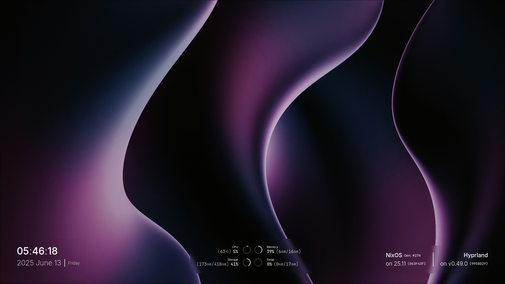

# shell

My work-in-progress shell configuration made with [Quickshell](https://quickshell.outfoxxed.me) to be used in Wayland Compositors and/or tiling window managers such as Hyprland, Swayfx/Sway, etc.

## Overview

A minimalist, misty shell concept designed and built for power users seeking a distraction-free, full-focus workflow while still remaining usable and accessible for most users.

It features a lot of widgets such as application launcher, workspace overview, power session, etc., that help mitigate the core barless concept.

Design reference is public and can be viewed and accessed in Figma Community:

> https://www.figma.com/community/file/1506658504473891805/mist-shell

## Screenshots

Desktop Wallpaper + Widgets (Date/Time, Resources, Versions)

Session Management

(Only these are implemented for now :sob: but there are more to follow; meanwhile, check out the design file if you're interested)

## Acknowledgements

These individuals have greatly contributed directly/indirectly to what I have now in this repository through feedback, guidance, and, believe it or not, vibes, so shout out to these really cool peeps:

- [Rexi](https://github.com/Rexcrazy804), [(flakes + dotfiles)](https://github.com/Rexcrazy804/Zaphkiel): Helped a lot of times with my nix skill issues
- [Soramane](https://github.com/soramanew), [(github org)](https://github.com/caelestia-dots/): I yoinked (and will continue yoinking) `/services` from this smart guy
- [end](https://github.com/end_4), [(dotfiles)](https://github.com/end_4/dots-hyprland): Really helpful with my Quickshell skill issues and knowledge gap
- [outfoxxed]([https://](https://git.outfoxxed.me/outfoxxed)), (Quickshell overlord and creator): Really helpful with my Quickshell skill issues and knowledge gap

and a couple other homies whose links I do not know/can't remember, sorry :sob:

- MilkMan (or PapaMilky)
- Aureus
- crispy caesus
- Squirrel Modeller
- oyudays

plus all the other cool peeps I've interacted with frequently but forgor and can't remember right now.

---

> [!Note]
> This repository is a submodule of a bigger repository. That said bigger repository is currently private, as it contains my whole flakes configuration, where some of the files present are potentially dangerous(?) to publicize. I still need to clean them up, but cannot find the right time for now. Maybe soon™.
>
> As such, simply cloning and running this on your system may not look as close to how it is in mine. Fortunately, this mostly applies only to the blurring of the layers, which should be an easy fix.
